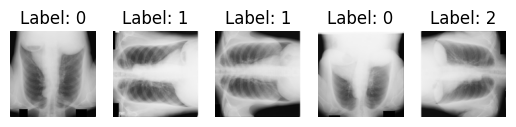

# Image Classification for ChestXray Direction Prediction

This repository uses the miniJSRT_database, which is a small dataset of Chest X-rays that can be used by beginners who would like to apply deep learning algorithms on a dataset. The dataset can ben found here: http://imgcom.jsrt.or.jp/minijsrtdb/

The aim of this project is to predict the direction of an image. To perform this task, the Directions dataset was used, which contains 988 pictures in different direction. There were 247 images in each of the following directions: up, down, right and left, out of which 948 were used for training and 40 for testing. Each picture is of size 128x128. A sample of the first five pictures with their labels can be seen below.

The architecture used was Resnet18. I updated the number of output features of the final layer to have 4 output options, which are the 4 possible directions.

To train the model, I created data loaders of size 10 and I ran 10 epochs. That returned a very small value to the loss function during training. To check how well the predictions were, I used the test dataset and saw very high accuracy of 1.00 in all test images. The model performed very well with the dataset provided, even with little training.

## References
[1] http://db.jsrt.or.jp/eng.php
[2] http://imgcom.jsrt.or.jp/minijsrtdb/
